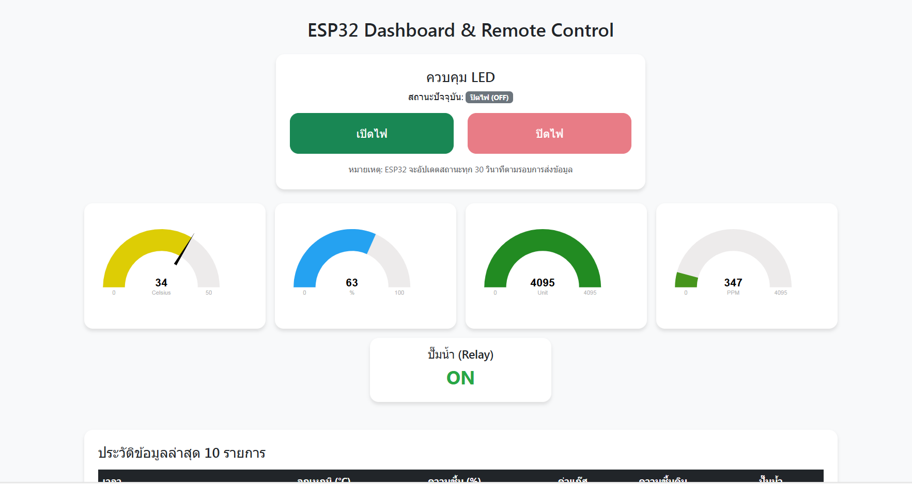
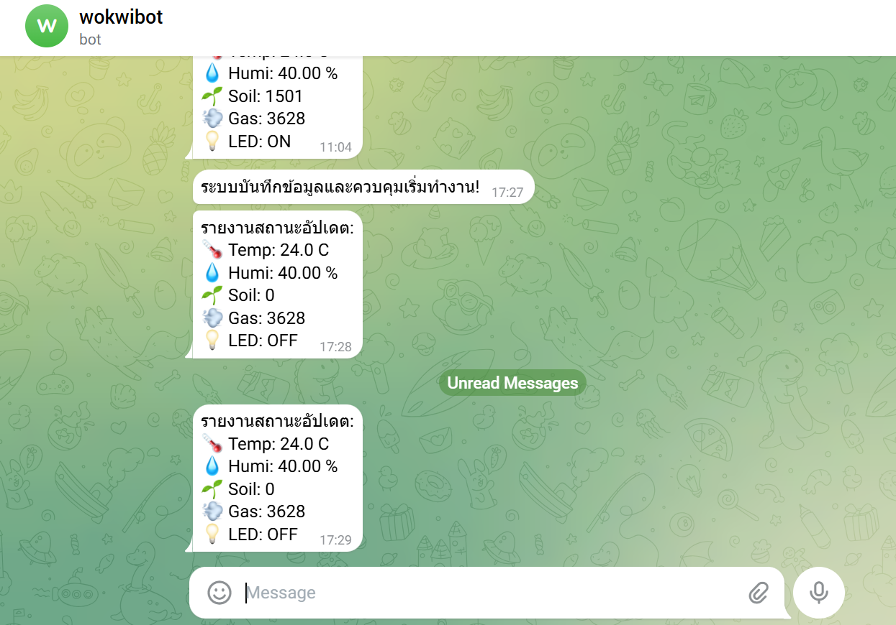

# 🌿 Smart Farm IoT: Edge Computing & Monitoring System

Smart Farm Management System using ESP32 + PHP + MySQL.  
Monitor environmental data and control farm equipment in real-time with Edge Computing logic.  

---

## 📌 Overview

โปรเจกต์นี้เป็นระบบจัดการฟาร์มอัจฉริยะ (Smart Farm) ที่ช่วยในการตรวจสอบสภาพแวดล้อมและควบคุมอุปกรณ์อัตโนมัติ โดยมีคุณสมบัติหลักดังนี้:

- Edge Computing Logic: ระบบตัดสินใจรดน้ำและแจ้งเตือนแก๊สได้ทันทีที่ตัวอุปกรณ์ แม้ไม่มีอินเทอร์เน็ต  
- Real-time Dashboard: แสดงค่า อุณหภูมิ, ความชื้นอากาศ, ความชื้นดิน และระดับแก๊ส ผ่าน Gauge Chart  
- Remote Control: สั่งงานเปิด-ปิดไฟ (LED) ผ่านหน้าเว็บ Dashboard ได้โดยตรง  
- Data Logging: บันทึกข้อมูลลงฐานข้อมูล MySQL เพื่อดูประวัติย้อนหลัง  
- Notification:** ระบบแจ้งเตือนผ่าน Telegram เมื่อค่าเซนเซอร์ถึงจุดวิกฤต    

---

## 🏗️ System Architecture

```text
          +-------------+
          |   ESP32     | <--- (DHT22, MQ-135, Soil Moisture)
          |  (Client)   | ---> (Relay, Buzzer, LEDs)
          +------+------+ 
                 |
                 | HTTP POST (with API Key Security)
                 v
        +------------------+
        |   PHP Server     | <--- (post-data.php)
        |    (XAMPP)       | <--- (index.php Dashboard)
        +--------+---------+
                 |
                 | SQL Query
                 v
          +-------------+
          |    MySQL    |
          | (esp32_db)  |
          +-------------+
```

---

## ✨ Features

- 🌡 Real-time Monitoring: แสดงผลอุณหภูมิและความชื้นด้วย JustGage  
- 💧 Smart Irrigation: สั่งเปิดปั๊มน้ำอัตโนมัติเมื่อดินแห้ง (ค่า > 3500)  
- ⚠️ Gas Leak Alert: ระบบแจ้งเตือนด้วยเสียง Buzzer เมื่อพบระดับแก๊สสูงเกินกำหนด 
- 🌐 Web Control: ปุ่มควบคุม LED ON/OFF พร้อมแสดงสถานะปัจจุบัน  
- 🛡 Security: ตรวจสอบ API Key ก่อนการรับส่งข้อมูลระหว่าง ESP32 และ Server  
- 📊 Data History: ตารางแสดงข้อมูลย้อนหลัง 10 รายการล่าสุด  
- 🗄 MySQL Data Storage  

---

## 📸 Screenshots

### 🟢 Web Dashboard & Control

[cite_start]*แสดงผลค่าเซนเซอร์แบบ Real-time และปุ่มควบคุม LED [cite: 43, 44]*

### 🤖 Physical Model (Diorama)

[cite_start]*โมเดลฟาร์มจำลองที่ประกอบอุปกรณ์ฮาร์ดแวร์เรียบร้อยแล้ว [cite: 34, 37]*

### 📱 Telegram Notification

[cite_start]*การแจ้งเตือนเมื่อค่าเซนเซอร์ถึงจุดวิกฤต [cite: 45]*

---

## 🛠 Tech Stack

| Technology | Purpose |
|------------|----------|
| PHP | Backend Scripting |
| MySQL | Database Management |
| Bootstrap 5 | Frontend UI Design |
| JustGage | Data Visualization (Gauge) |
| ESP32 | Microcontroller & Sensors |
| WiFiManager | WiFi Configuration (No hardcode) |

---

## 📦 Installation Guide

### 1️⃣ การตั้งค่าเว็บเซิร์ฟเวอร์ (XAMPP)

```bash
1.ติดตั้ง XAMPP ไว้ที่ C:\xampp
2.นำไฟล์ในโฟลเดอร์ Web/ ทั้งหมดไปวางที่ C:\xampp\htdocs\smartfarm\
3.เปิด XAMPP Control Panel และ Start บริการ Apache และ MySQL
```

---

### 2️⃣ การตั้งค่าฐานข้อมูล (MySQL Setup)
#### เข้าหน้า http://localhost/phpmyadmin/ แล้วสร้างฐานข้อมูลชื่อ esp32_db จากนั้นรัน SQL นี้:
```bash
CREATE TABLE sensor_data (
    id INT AUTO_INCREMENT PRIMARY KEY,
    temperature FLOAT, humidity FLOAT,
    gas_level INT, soil_moisture INT,
    relay_status VARCHAR(5),
    timestamp TIMESTAMP DEFAULT CURRENT_TIMESTAMP
);

CREATE TABLE control_panel (
    id INT PRIMARY KEY,
    status INT DEFAULT 0
);
INSERT INTO control_panel (id, status) VALUES (1, 0);
```
---

### 3️⃣ การเตรียม Firmware (ESP32)

#### Create Database

```sql
1.เปิดไฟล์ esp32.ino ด้วย Arduino IDE
2.แก้ไข serverName ให้เป็น IP ของคอมพิวเตอร์คุณ (เช่น http://yourserverip/smartfarm/post-data.php)
3.ทำการคอมไพล์และอัปโหลดโค้ดลงบอร์ด
```

#### Create Table

```sql
CREATE TABLE sensor_data (
  id INT AUTO_INCREMENT PRIMARY KEY,
  temperature FLOAT,
  humidity FLOAT,
  distance FLOAT,
  created_at TIMESTAMP DEFAULT CURRENT_TIMESTAMP
);
CREATE TABLE device_state (
  id INT AUTO_INCREMENT PRIMARY KEY,
  fan TINYINT(1) DEFAULT 0,
  light TINYINT(1) DEFAULT 0,
  light2 TINYINT(1) DEFAULT 0,
  mode VARCHAR(20) DEFAULT 'AUTO',
  updated_at TIMESTAMP DEFAULT CURRENT_TIMESTAMP 
             ON UPDATE CURRENT_TIMESTAMP
);
INSERT INTO device_control (fan, light, light2, mode)
VALUES (0, 0, 0, 'AUTO');
```

---

## 📁 Project Structure

```text
SmartFarm/
│
├── Web-Dashboard/      # ไฟล์ฝั่ง Server
│   ├── config.php      # ตั้งค่าฐานข้อมูล
│   ├── index.php       # Dashboard & Control
│   └── post-data.php   # API รับข้อมูลจาก ESP32
│
├── Firmware/           # โค้ดฝั่ง Hardware
│   └── esp32/
│       └── esp32.ino   # โค้ดหลัก ESP32
│       └── config.h    # ตั่งค่า ESP32
├── screenshots/        # รูปภาพประกอบ
└── README.md           # เอกสารฉบับนี้
```

---

## 🔒 ความปลอดภัยและการตรวจสอบ (Security)

- API Key Authentication: ทุกการส่งข้อมูล POST ต้องมีพารามิเตอร์ api_key ที่ถูกต้อง  
- SQL Sanitization: ใช้ระบบการกรองข้อมูลก่อนบันทึกเพื่อป้องกัน SQL Injection  
- Edge Computing Reliability: ระบบถูกออกแบบมาให้ปั๊มน้ำและระบบแจ้งเตือนทำงานได้ "Offline" เสมอ  

---

## 📈 Future Improvements

- Interactive Graphs: เพิ่มกราฟแสดงแนวโน้มย้อนหลังด้วย Chart.js  
- Manual/Auto Mode: สลับโหมดการทำงานระหว่างอัตโนมัติและสั่งการเองผ่านหน้าเว็บ  
- Data Export: ระบบส่งออกข้อมูล (Export) เป็นไฟล์ Excel/CSV  
- Authentication: ระบบ Login สำหรับเข้าถึง Dashboard เพื่อความปลอดภัย  
- OTA Update: ระบบอัปเดตโค้ด ESP32 ผ่าน WiFi (Over-the-Air)  
- Solar Powered: พัฒนาชุดจ่ายไฟด้วยระบบโซลาร์เซลล์สำหรับการใช้งานนอกสถานที่
  
---

## 👨‍💻 Author

Mini Project – Smart Farm IoT Implementation  
Developed for academic project submission 🚀
